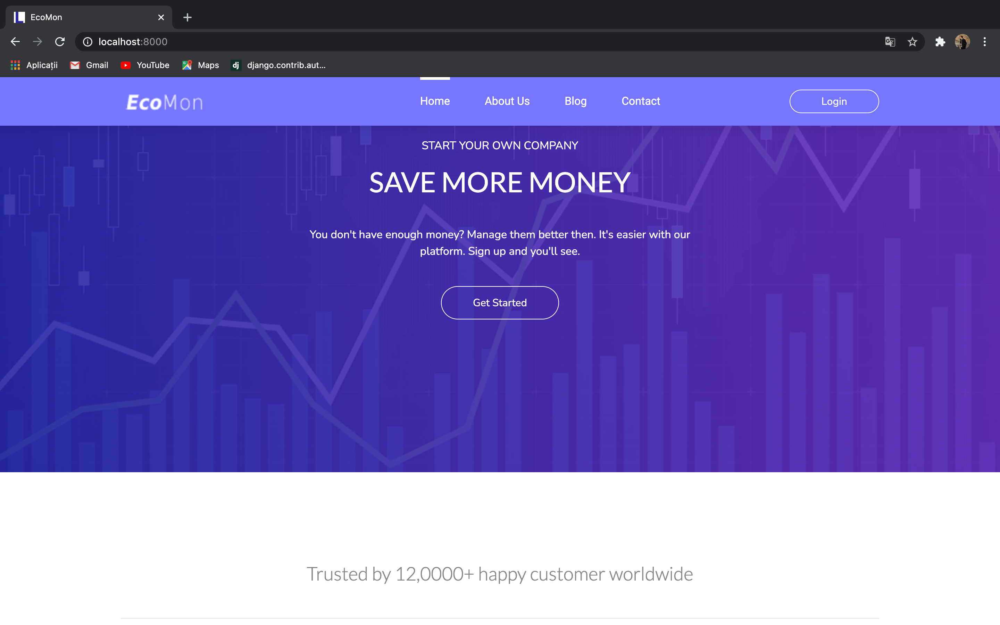
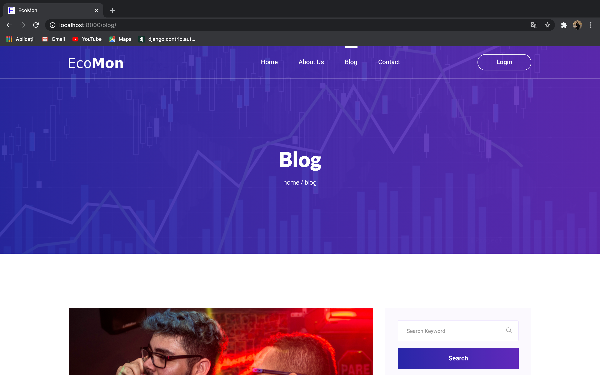
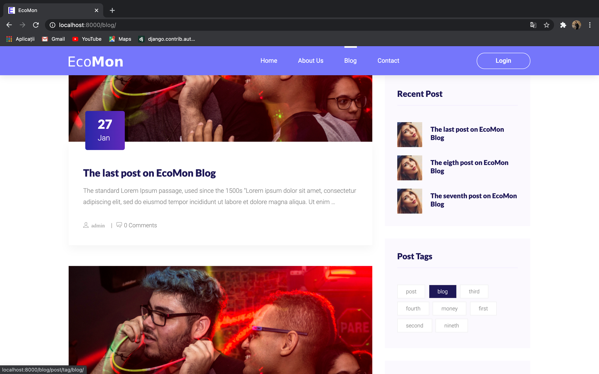
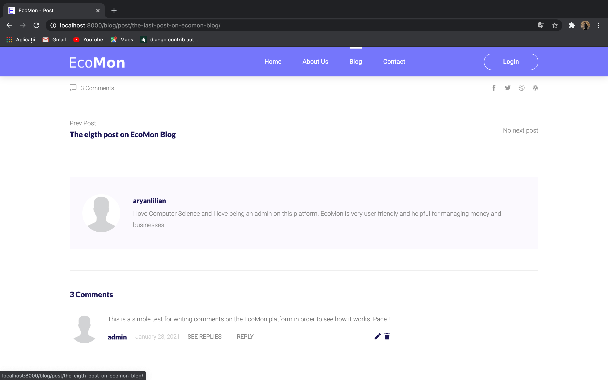
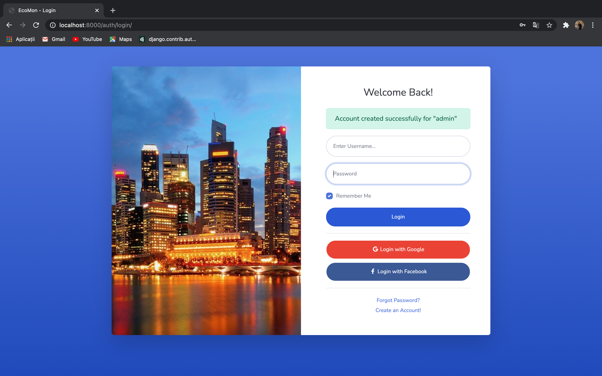
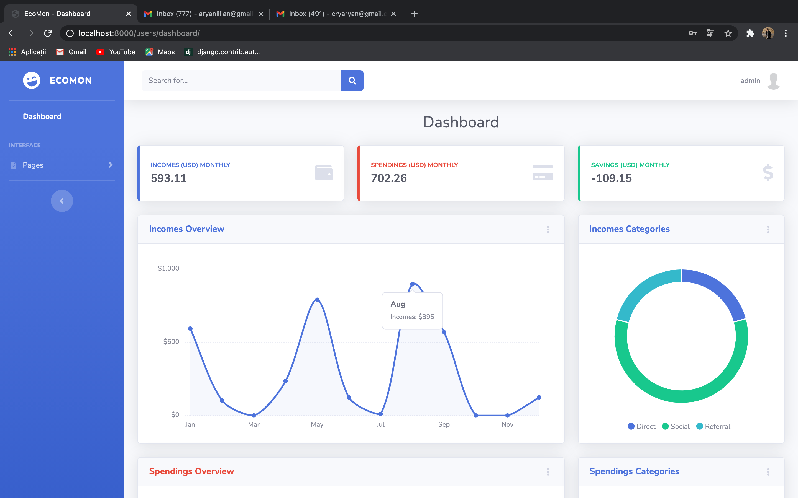
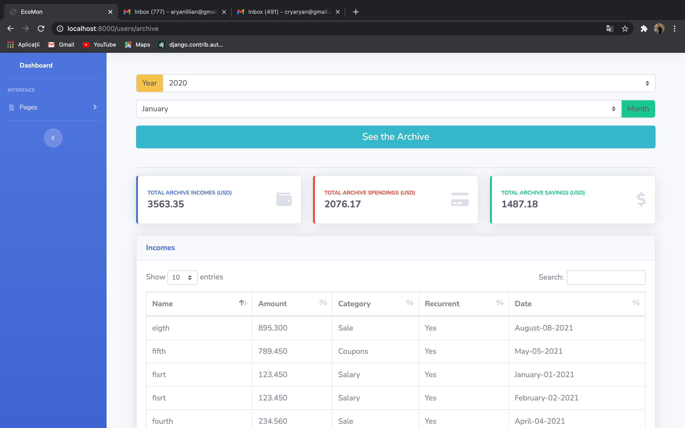

# EcoMon

First steps to do when setting the EcoMon project on your local machine with Django

## Getting Started

Setup project environment with [virtualenv](https://virtualenv.pypa.io) and [pip](https://pip.pypa.io).

```bash
$ virtualenv project-env
MacOS
    $ source project-env/bin/activate
Windows
    $ cd project-env/Scripts/activate
$ git clone https://github.com/aryanlilian/EcoMon.git
$ cd EcoMon
$ pip install -r requirements.txt

# You may want to change the name `project-env`.
$ python manage.py makemigrations
$ python manage.py migrate
$ python manage.py runserver
```
_I've built this website because I want to help a lot of people to manage their funds more efficiently and have a lot of savings every month, in order to start some small business or make a lot of investments._

#### Website Pages:
    - The Index-Page: consists of a website presentation, explanation of all the features and has a warm welcome for the users.

    - The Profile-Page is the page where users can set or update personal information and the currency of the wallet.

    - The Blog-Page is a page where you can read a lot of posts about money or how to manage them better and make savings, investments, etc. Also on this page for every post, you can write a comment and discuss it with other users on the website.

    - About-Page: consists of information about the platform, how was founded, and for what purpose

    - Contact-Page: consists of a contact form for users to get in touch with the staff and report problems or suggest ideas.

    - Login-Page: consists of a login form for the existent users.

    - Registration-Page: consists of registration form for the new users

    - The Dashboard-Page: All the spendings and budgets have a total and you get your current total automatically with our website every time you add a new spending or income. On the Dashboard-Page you can see also how much of your incomes are the spendings and the savings (in percentages). This page has charts for better management of the incomes and spendings.

    - Income-Page: on this page, you can add personalized incomes and see all the incomes of the current month in a table, also the total incomes of the previous and current month.

    - Spending-Page: on this page you can add personalized spendings and see all the spendings of the current month in a table, also the total spendings of the previous and current month

    - Archive-Page: here practically you can see all your spendings, budgets, and savings from a specific year and month, as an archive. All the information is selected from the database to make the user experience more efficient.

    - Profile-Page: every personal information of a user is shown here, also the user can update every personal information for a better experience on the platform.

#### Features that I implemented so far:
    * Google API (Login with Google)
    * Facebook API (Login with Facebook)
    * PostgreSQL Database Register and Authentication
    * Full CRUD feature on User Profile
    * Full CRUD feature on objects (Incomes, Spendings, Blog posts, Post comments)
    * Archive feature (Selecting specific objects from the Databases)
    * User comments feature
    * JavaScript Charts,
    * Filtering Blog posts by tags
    * Forms validation (error messages are shown in case of invalid data)

Index-Page:



Blog-Page:




Post-Page:




Contact-Page:


Register-Page:


Login-Page:


Dashboard-Page:



Incomes-Page:


Spendings-Page:


Profile-Page:


Archive-Page:



